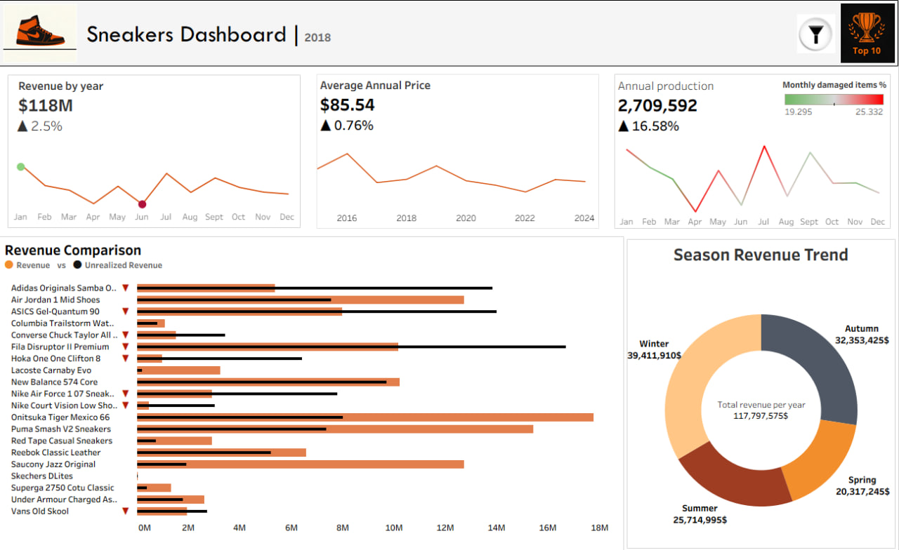
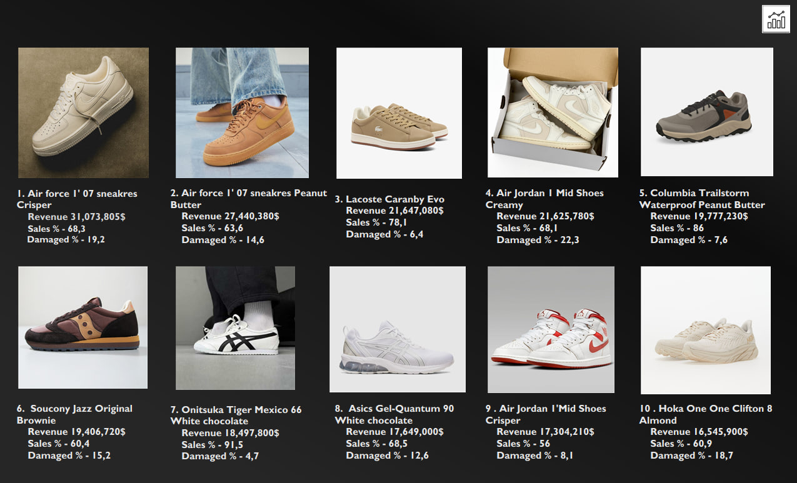

# Sneaker-Data-Exploration
## DASHBOARD PREVIEW

<h3 align="center">Main Dashboard – Charts</h3>

<h3 align="center">Top 10 Sneakers</h3>

# TABLE OF CONTENT
- [DASHBOARD LINK](#DASHBOARD-LINK)
- [INTRODUCTION](#INTRODUCTION)
- [DATASET INFORMATION](#dataset-information)
- [DATA CLEANING & TRANSFORMATION](#DATA-CLEANING-TRANSFORMATION)
- [DASHBOARD STRUCTURE](#DASHBOARD-STRUCTURE)
- [TOOLS USED](#TOOLS-USED)
---

## DASHBOARD LINK 

You can explore the full interactive version of the dashboard on Tableau Public:

🔗 **[Open the Interactive Dashboard](https://public.tableau.com/app/profile/volodymyr.tarasyuk/viz/SneakersDashboard/Charts)**

The Tableau dashboard allows you to:
- Explore sneaker price trends
- Analyze brand distribution
- View the Top 10 most expensive sneakers
- Interact with filters and charts

## INTRODUCTION

The global sneaker market is highly competitive, with brands constantly balancing demand, inventory levels, and product condition. While some models generate strong revenue and high sell-through rates, others underperform due to damage rates, overproduction, or seasonal fluctuations.

This project explores a dataset of 500 sneaker models to analyze revenue performance, sales efficiency, inventory health, and seasonality patterns. The goal is to identify high-performing models, measure the financial impact of product damage, and uncover trends that influence overall profitability.

By combining SQL-based aggregation with interactive visualization in Tableau, this analysis highlights which models truly drive revenue and which operational factors may limit performance.

## DATASET INFORMATION 
- Source: [Kaggle – 500 Sneakers Dataset](https://www.kaggle.com/datasets/comhek/500-snickers-dataset?select=snicker_dataset_with_dates.csv)
- Rows: 500
#### FIELDS(after cleaning/transformation)
- Name 
- Type
- Total sold
- Total unsold
- Damaged
- Month
- Year
- Quarter
- Edition
- Price
- Gender
- Sales percent
- Damage percent
- Estimated revenue
- Unrealized revenue
- Unrealized revenue(damaged)
- Price bucket

## DATA CLEANING & TRANSFORMATION

Before building the dashboard, the dataset was cleaned and prepared to ensure analytical consistency and business relevance.

#### REMOVED COLUMNS 
The following columns were excluded as they did not add value to the intended level of analysis:

- `Snapshot_Date`
- `Manufacturing_Date`
- `Selling_Date`
- `Units_Received` (validated as identical to `total_produced`)
- `Performance_Score`
- `Sneaker_Grade`

Since the analysis focuses on monthly and quarterly trends, daily-level granularity was removed as unnecessary.

#### RENAMING & STANDARDIZATION

- `Unsold_Inventory` was renamed to `Total unsold` for consistency.
- `Gender` values were standardized to `M` and `F`.
- Special characters (apostrophes) were removed from product names to ensure compatibility with PostgreSQL.
- Revenue columns were formatted for clarity and better visualization in Tableau.

#### CREATED BUSINESS METRICS

To enhance business analysis, additional calculated fields were introduced:

- **Unrealized Revenue**  
  `(total_produced - total_sold - damaged) * price`  
  Represents capital tied in unsold items.

- **Unrealized Revenue(Damaged)**  
  `damaged * price`  
  Estimates revenue lost due to damaged units.

## Dashboard Structure

This interactive dashboard provides a comprehensive view of sneaker market performance over 10 years, focusing on revenue, operational efficiency, and seasonal demand.

### KPI Section
Three dynamic KPI cards summarize key metrics for the selected year:

- Total Revenue with year-over-year comparison  
- Average Price Trend  
- Total Production with Damage Rate  

Each KPI updates automatically based on the selected year.

### Revenue Comparison Chart
Compares realized revenue with unrealized revenue for top-performing sneaker models, including:

- Revenue lost due to damaged units  
- Revenue tied in unsold inventory  

This helps identify models where operational inefficiencies impact profitability.

### Seasonality Analysis
Displays quarterly sales distribution to identify peak demand periods and seasonal trends.

### Top 10 Models Page
Highlights the top 10 sneaker models based on revenue performance, filtered by above-average sales and below-average damage rates.

---

## Dashboard Recommendations & Key Observations

This dashboard is designed for **interactive exploration** of 10 years of sneaker sales data:

- Use the year filter to compare trends, sales, and top brands across different years.  
- Track changes in average prices and sales volumes to identify growth or decline patterns.  
- Pay attention to damaged items to assess potential risks and operational issues.  
- Explore top-performing brands and models using dynamic sorting and filters.  
- Switch between years and categories to discover trends without relying on a single fixed insight.  

> The dashboard supports flexible, on-demand analysis rather than static conclusions, providing a practical tool for business decisions and trend evaluation.

## TOOLS USED

- Microsoft Excel / Power Query (data preparation)
- Tableau (interactive dashboard and visualization)
- SQL (data aggregation and filtering)
- GitHub (project documentation and version control)
